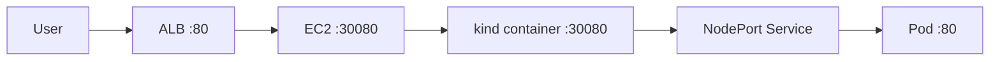

# K8s on AWS - Terraform 1-Click

Lab này dựng 1 web Xbrain basic EC2 chạy `kind`, deploy app Nginx trong Kubernetes, và expose ra Internet qua ALB bằng Terraform.

## Kiến trúc



## Thành phần chính

1. Terraform tạo VPC, subnet public, Security Group, IAM Role, EC2, ALB và Target Group.
2. Provider `aws` là hạ tầng chính.
3. Provider `random` dùng để tạo suffix tránh trùng tên tài nguyên.
4. `scripts/user_data.sh` cài Docker, kind, kubectl và apply manifest K8s.
5. `k8s/app.yaml` chứa ConfigMap, Deployment và Service NodePort.

## Chạy dự án

```bash
terraform init
terraform apply -auto-approve
```

## Xác nhận sau deploy

```bash
terraform output -raw app_url
terraform output -raw alb_dns_name
terraform output -raw ec2_instance_id
terraform output -raw target_group_arn
```

```bash
aws elbv2 describe-target-health --target-group-arn $(terraform output -raw target_group_arn)

```

Trong EC2, kiểm tra thêm:

```bash
kubectl get nodes
kubectl get pods -o wide
kubectl get svc

```

Nếu ALB trả về trang Xbrain và `TargetHealth.State` là `healthy` thì đạt.

## Vì sao chọn cách này

1. `kind` nhẹ, hợp với bài toán 1 EC2 và demo nhanh.
2. Docker cần cho `kind`, nên được cài trong `user_data` thay vì thêm file riêng.
3. ALB trỏ vào port `30080` giúp luồng traffic đi đúng vào NodePort trong cluster.
4. Không dùng Terraform Kubernetes provider để tránh bài toán gà-và-trứng khi cluster chưa tồn tại.

## Dọn dẹp

```bash
terraform destroy -auto-approve
```
